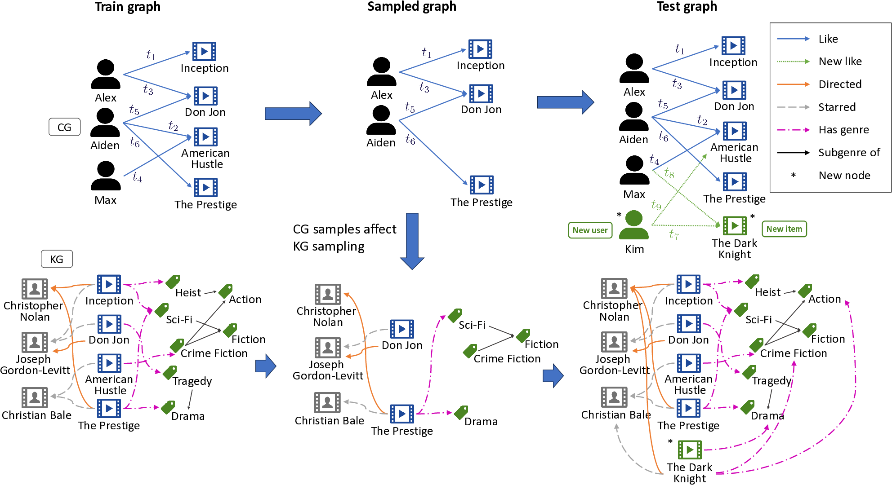
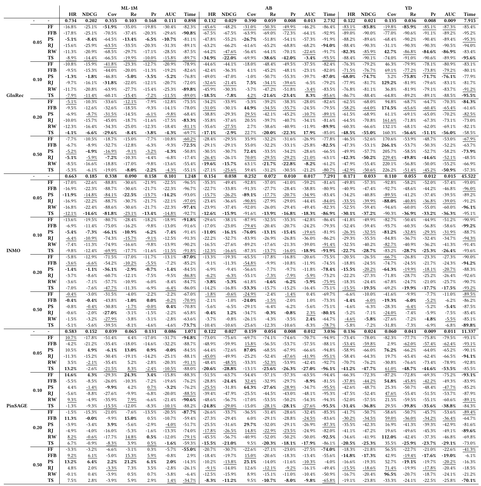

# The Limits of Graph Samplers for Training Inductive Recommender Systems

Please reference our work if using it in other projects.
We study the effect of sampling using state-of-the-art graph neural networks for inductive recommender systems as illustrated in the figure below.


We expand and show all results here:



# Requirements
The following applications must be installed on your system.
```
python3.10
python3.10-venv
docker
docker-compose-plugin
```

We note this project requires more than 200GB of disk space for the Yelp KG construction.

# FIRST GET APPROVAL FOR DATASET USAGE, SEE [datasets/README.md](datasets/README.md)

# Instantiate the environment and preprocess datasets
If above requirements are met, you can run the following commands to install the environment and preprocess the datasets.
Assuming you are in the root directory of the project you can run the docker_builder.sh script to build the docker image.
It will build and run required files. It will prompt for download of the [Yelp Dataset](https://www.yelp.com/dataset/), 
such that it can be processed. After downloading and placing in the required folder, run the script again.

```bash
./docker_builder.sh
```

After running, a terminal will at `/app` in the docker container. You can run the following commands to preprocess the datasets.
```bash
cd datasets; ./dataset_preparations.sh
```
You may need to run `chmod +x dataset_preparations.sh` to make the script executable.

# Training and evaluation

Run the following command to start the tuning of the methods. You can specify the GPU indices as 
`--gpu 0 0 1 1` to use multiple GPUs or same GPU multiple times. 
```bash
python3 py_run_parallelized.py
```

After tuning, run to fully train given the parameters above.
```bash
python3 py_run_multi.py
```

Rerun using `--eval` to evaluate the models.
```bash
python3 py_run_multi.py --eval
```

To run the subgraph sampling experiments, run the following command.
```bash
python3 py_run_multi.py --apply_sampling
```

Followed by running the evaluation, which is the above but with `--eval` flag. Possibly test speed by increasing the number
of test workers with `--test_workers 4` or similar. Default is 2. 

# Computing metrics
To compute the metrics, run the following command. It will compute the metrics for all methods and datasets.
```bash
cd evaluate
./eval_script.sh
```

There are now multiple pickle files, one for each dataset, method, and experiment. Loading these files will give all
user metrics with k's from 1 to 50. Perform whatever analysis you want on these files.

## General information about the framework<a id="general-information-about-the-framework"/>
Under configuration you will find all parameters for the models as well as dataset and experiment configuration. 
For datasets you can define a mapping of ratings, such as explicit to implicit and apply filters, such as minimal number 
of ratings using CountFilter:
```
ml_mr_1m = DatasetConfiguration('ml-mr-1m', lambda x: {x > 3: 1}.get(True, 0),
                                filters=[CountFilter(lambda c: c >= 5, sentiment=Sentiment.POSITIVE)],
                                max_users=12500)
```

All methods, experiments and datasets must be defined in these folders before use. All methods are located in the models 
folder and inherit from the RecommenderBase class in dgl_recommender_base.py

Look in datasets folder for the construction of datasets.

## NOTICE<a id="notice"/>
Section describing modifications to documents under the Apache License or for recognition.
Both IGMC and NGCF are originally under the Apache License.

### Models<a id="models"/>

#### NGCF and LightGCN
Based on the example of NGCF in Based on https://github.com/dmlc/dgl/tree/master/examples/pytorch/NGCF modified to 
include LightGCN and using blocks.

### DGL<a id="dgl"/>
Under models/shared/dgl_dataloader.py, you will find changes of the DGL EdgeCollator classes and 
EdgeDataloader to skip certain graph building steps. 
